# Horizon Freight Logistics – IT Service Desk (CompTIA A+ Simulation)
This project simulates an internal IT Service Desk for a 25-employee hybrid logistics company.  
It demonstrates structured troubleshooting using the CompTIA A+ 6-step methodology, workflow enforcement, knowledge base integration, root cause documentation, and metrics tracking.
The goal of this project is to model real-world help desk operations in a small business environment.

---
## 🧠 CompTIA A+ 6-Step Troubleshooting Model

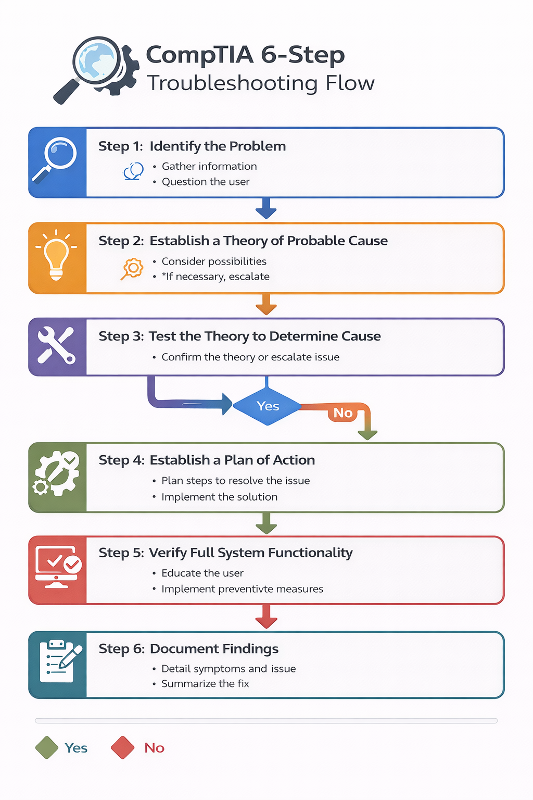
## 📸 Account Lockout – Visual Walkthrough

### Ticket Queue
The service desk queue displays active and prioritized tickets across hardware, identity, software, and network categories.At the time of submission, multiple tickets were in various states (New, In Progress, Waiting on User), reflecting a live operational environment.The Account Lockout ticket was categorized as a Login Issue and prioritized appropriately based on user impact. This demonstrates proper ticket classification and workload visibility before beginning investigation.
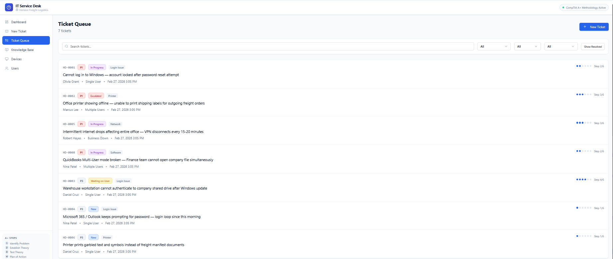

### New Ticket Creation
All incidents are formally submitted through a structured intake form requiring:

- User identification  
- Related device association  
- Category classification  
- Clear problem description  
- Error message details  
- Impact assessment  
- Urgency level  

This ensures proper triage, priority assignment, and traceability before troubleshooting begins.Capturing structured data at submission prevents incomplete investigations and supports accurate metrics tracking across the service desk environment.
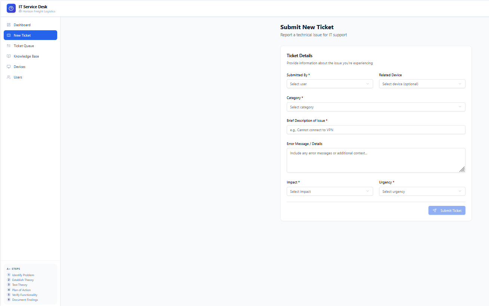

### Ticket Detail – Step Flow View
The ticket detail view enforces the CompTIA A+ 6-step troubleshooting methodology within the workflow itself.  

Technicians cannot skip steps and must document findings sequentially:

1. Identify the Problem  
2. Establish Theory  
3. Test the Theory  
4. Plan of Action  
5. Verify Functionality  
6. Document Findings  

This structured progression ensures disciplined troubleshooting, reduces guesswork, and creates a clear audit trail of decision-making.The right-hand status panel reflects real-time progression, preventing premature ticket closure before proper documentation is completed.
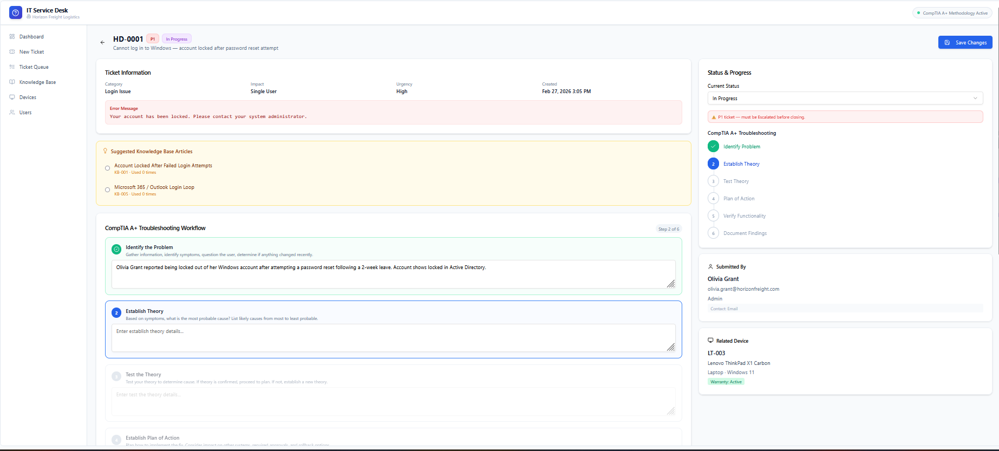

### Troubleshooting – Investigation Phase
During the investigation phase, structured analysis was applied to eliminate potential causes before remediation.

Actions taken included:
- Reviewing account status in directory services
- Checking login attempt logs for suspicious IP activity
- Verifying recent password reset attempts with the user
- Identifying potential cached credential conflicts

By systematically validating each possibility, the investigation ruled out malicious access and confirmed the lockout resulted from authentication inconsistencies following a password change.This step demonstrates disciplined root cause validation rather than assumption-based troubleshooting.
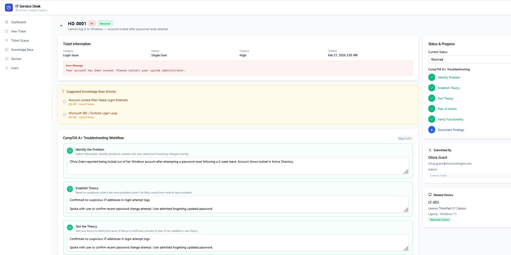

### Resolution & Closure
The resolution phase formally documents:

- Verified root cause classification  
- Time spent for metric tracking  
- Clear resolution summary  
- Preventative guidance provided to the user  

In this case, the lockout was confirmed as a user-side authentication issue rather than a security breach.  The account was unlocked, password reset validated, and successful login verified across both Windows and VPN authentication systems.Documenting time spent (18 minutes) contributes to service desk performance metrics such as average resolution time and incident tracking.This structured closure ensures transparency, accountability, and continuous improvement within the IT support workflow.
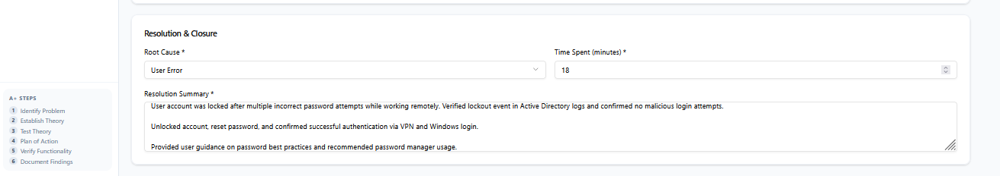

### Dashboard Metrics After Resolution
The operations dashboard reflects real-time service desk performance metrics following ticket resolution.

Key performance indicators displayed include:
- Open ticket volume  
- In-progress workload  
- Waiting-on-user backlog  
- Critical incident rate  
- Escalation rate  
- Root cause distribution  

Closing the Account Lockout incident updated system metrics, contributing to accurate tracking of average resolution time and root cause analysis trends.This demonstrates awareness of how individual tickets impact overall service desk performance and operational visibility.
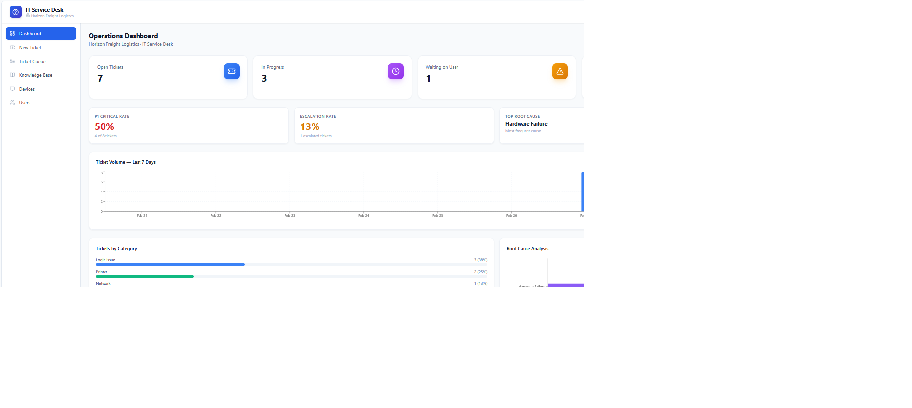

---
## 💻 Laptop Not Powering On – Visual Proof

### Troubleshooting Workflow
The troubleshooting workflow demonstrates structured hardware diagnostics using the CompTIA A+ methodology.

The investigation began by validating power delivery and eliminating potential hardware failure:

- Confirmed wall outlet functionality
- Tested device with known-good power adapter
- Verified battery charge state
- Eliminated motherboard failure by confirming power restoration

Rather than assuming hardware failure, systematic testing identified a faulty power adapter as the true root cause.This reflects disciplined elimination-based troubleshooting rather than part replacement or guesswork.
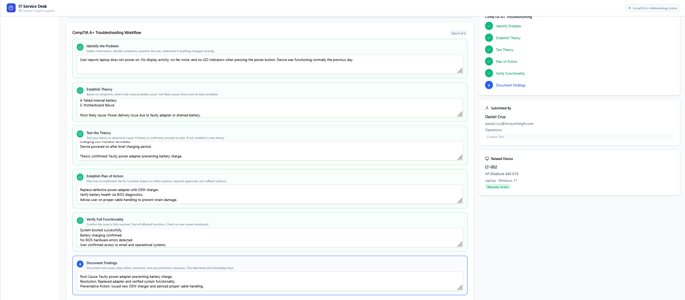

### Resolution & Closure
The closure phase formally documents:

- Root cause classification (Hardware Failure)
- Time spent (22 minutes)
- Clear remediation summary
- Preventative recommendation

The defective adapter was replaced with an OEM charger.Battery charging was verified and full system boot confirmed.Documenting both resolution time and preventative guidance ensures accurate performance metrics and reduces repeat incidents.
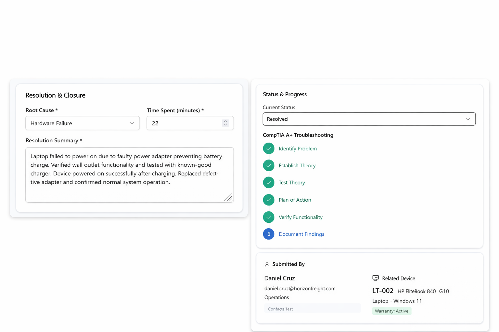

---
## ⚙️ Slow Laptop Performance – Visual Proof

### Troubleshooting Workflow
This scenario demonstrates structured performance analysis and system optimization.

The investigation focused on identifying resource bottlenecks:

- Reviewed Task Manager performance metrics
- Analyzed disk utilization trends
- Audited startup applications
- Conducted malware scan to eliminate security threats

High disk utilization was traced to low available storage and excessive startup processes.This highlights performance-based troubleshooting using measurable system indicators rather than assumptions.
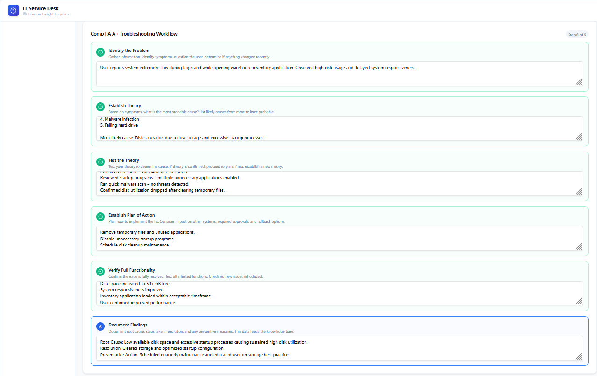

### Resolution & Closure
The resolution phase restored system responsiveness by:

- Clearing temporary files
- Removing unused applications
- Disabling unnecessary startup processes
- Verifying normalized disk utilization

Root cause was categorized as Misconfiguration.Time spent (28 minutes) was recorded to maintain accurate service desk performance tracking.Preventative maintenance guidance was provided to reduce recurrence and improve long-term system stability.
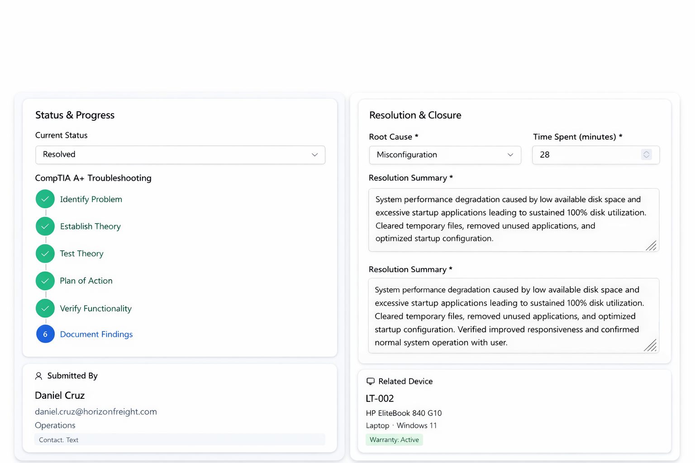

---
